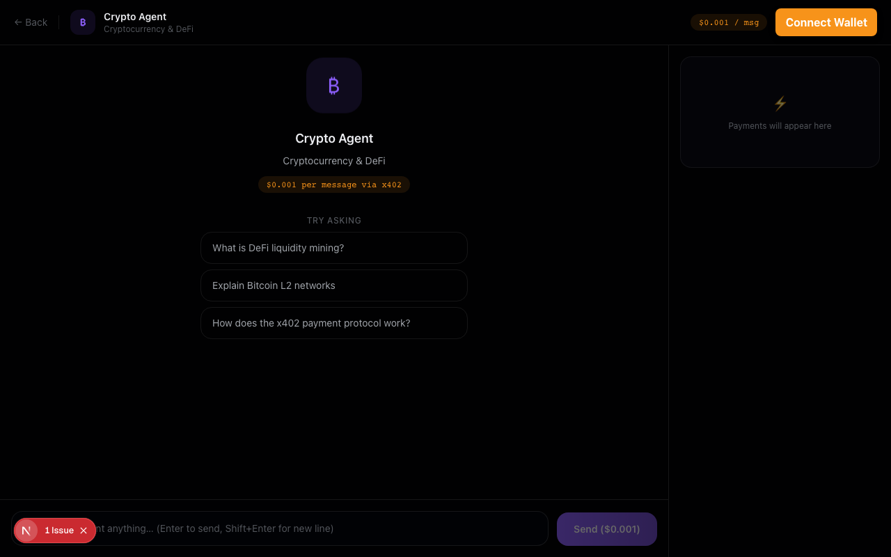
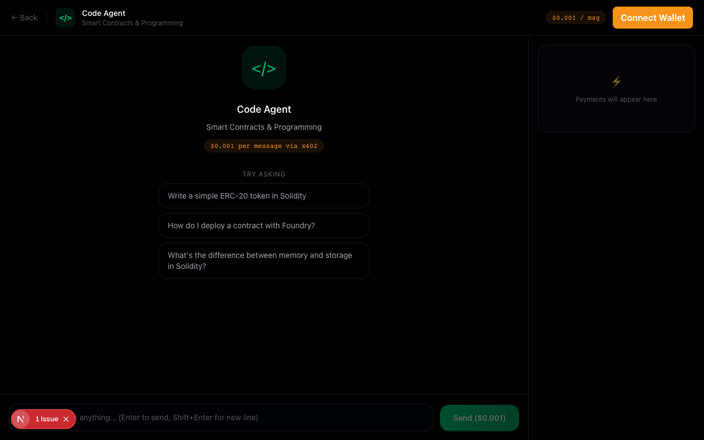

<div align="center">

# BitMind Lite

> AI Agent 自动协作与链上付费演示 — Bitcoin L2 × x402 协议


### 两个 AI Agent，自动付费协作，共同回答你的问题


[功能](#核心能力) · [截图](#界面截图) · [快速开始](#快速开始) · [环境变量](#环境变量) · [API](#api-契约)

**简体中文** | [English](./README_EN.md)

---

</div>

## 项目简介

BitMind Lite 演示了一个完整的 **Agent Economy** 闭环：两个专业 AI Agent 在 Bitcoin L2 上通过 [x402 协议](https://x402.org) 自动付费协作，共同回答用户的问题。

| Agent | 专长 | 链上 Token |
|-------|------|-----------|
| **Crypto Agent** | 加密市场、DeFi、链上趋势分析 | ERC-721 #1 |
| **Code Agent** | Solidity、智能合约、Web3 开发 | ERC-721 #2 |

---

## 协作流程

```
用户
 │
 │  $0.001 via x402
 ▼
Crypto Agent ──── 超出专长？──── 是 ──▶ 付费委托 Code Agent
 │                                              │  $0.001 (A2A)
 │  (直接回答)                                  ▼
 └─────────────────── 整合答案 ◀──── Code Agent 返回
                           │
                           ▼
                  最终答案 + 右侧资金流记录
```

遇到跨专长问题时（如向 Crypto Agent 提代码问题），主 Agent 自动向另一个 Agent 发起 x402 付费请求，用户始终收到一个完整答案。

---

## 界面截图

| 首页 | Crypto 聊天页 | Code 聊天页 |
|------|-------------|-----------|
|  |  |  |
| 双 Agent 入口卡片 | 市场/DeFi 对话 + 提示词 | Solidity/开发对话 + 提示词 |

---

## 快速开始

**前置要求：** Node.js 18+、pnpm、至少一个 AI API Key（OpenAI 或 Anthropic）

```bash
# 1. 安装依赖
pnpm install

# 2. 配置环境变量
cp .env.local.example .env.local
# 编辑 .env.local，填入 OPENAI_API_KEY 或 ANTHROPIC_API_KEY

# 3. 启动
pnpm dev
```

访问 `http://127.0.0.1:3000`

### 可以试着问

**Crypto Agent（市场 / DeFi 问题）**
- "什么是 DeFi 流动性挖矿？"
- "解释一下 Bitcoin L2 网络"
- "x402 支付协议是如何工作的？"

**Code Agent（合约 / 开发问题）**
- "用 Solidity 写一个简单的 ERC-20 代币"
- "如何用 Foundry 部署合约？"
- "Solidity 中 memory 和 storage 有什么区别？"

> 向 Crypto Agent 提代码问题（或反向），可触发自动 A2A 付费协作流程。

---

## 项目计划书参考（可直接复用）

以下结构可直接给你朋友写立项/项目计划书，按需替换公司名与时间线。

### 1) 项目目标

- 目标：构建可演示、可扩展的双 Agent 协作系统，验证 Agent 之间按次付费协作（x402）闭环
- 业务价值：让垂直 Agent 可独立计费、协作分工，降低单模型全能化成本
- 成功标准：
  - 跨领域问题触发协作准确率达到预期
  - API 可用性达标（健康检查、契约测试稳定通过）
  - 演示链路可重复（本地 demo + 可选 payment 模式）

### 2) 范围定义

- In Scope：
  - Crypto / Code 双 Agent
  - 自动协作判定 + 防递归委托
  - x402 路由付费保护与 A2A 付费调用
  - 基础安全（清洗、限流、长度与体积限制）
- Out of Scope（首期不做）：
  - 多 Agent 编排平台化（>2 Agent）
  - 生产级分布式限流/观测平台
  - 多链结算与复杂清结算对账

### 3) 里程碑（示例 3 周）

| 周期 | 里程碑 | 关键产出 |
|------|--------|----------|
| Week 1 | MVP 可用 | 双 Agent 对话、协作触发、mock 模式可跑通 |
| Week 2 | 付费闭环 | `X402_ENABLED=true` 路由保护 + A2A paid fetch |
| Week 3 | 工程化验收 | `verify` 全通过、README/截图/演示脚本齐备 |

### 4) 交付物清单

- 代码仓库与部署说明
- API 契约与测试报告（unit/smoke/contract）
- 演示环境配置（`.env` 模板）
- 项目文档（README 中英双语 + 架构流程图）

---

## 运行模式

| 模式 | 开关 | 行为 |
|------|------|------|
| Demo（默认） | `X402_ENABLED=false` | 不强制支付，协作走本地逻辑，适合开发测试 |
| Payment | `X402_ENABLED=true` | 启用 x402 路由保护，A2A 通过真实 HTTP 付费调用 |

> `X402_ENABLED=true` 但 x402 初始化失败时，后端自动降级为直接执行。

---

## 核心能力

**双 Agent 自动协作**
- 通过系统提示词和响应 payload 判断是否委托另一个 Agent
- 拦截递归协作，防止无限委托链

**x402 资源保护**
- 路由级付费访问（`@x402/next`）
- Agent-to-Agent 付费请求（`@x402/fetch`）

**安全与健壮性**
- 前后端输入清洗 + 消息长度限制（默认 4000 字符）
- 请求体大小限制（默认 16 KB）
- 固定窗口限流（按 `agent + client-ip`，默认 30 次/分钟）
- 安全响应头（CSP、X-Frame-Options、X-Content-Type-Options 等）

**可执行质量门禁**
- `lint + typecheck + unit + build + smoke + api contract`

---

## API 契约

| Endpoint | Method | 成功响应 | 常见错误 |
|----------|--------|---------|---------|
| `/api/health` | `GET` | `200 {status:"ok"}` | — |
| `/api/agent/crypto` | `POST` | `200 {reply, agent[, collaboration]}` | `400` `413` `429` `500` |
| `/api/agent/code` | `POST` | `200 {reply, agent[, collaboration]}` | `400` `413` `429` `500` |

`GET /api/agent/*` 返回 `405`（Next Route Handler 默认行为）。

---

## 测试与质量门禁

```bash
pnpm run lint          # ESLint 静态检查
pnpm run typecheck     # TypeScript 类型检查
pnpm run test:unit     # 单元测试
pnpm run build         # 构建验证
pnpm run test:smoke    # 冒烟测试
pnpm run test:api      # API 合约测试
pnpm run verify        # 全量验证（以上全部）
```

---

## 技术栈

- **框架**：Next.js 16 + TypeScript + Tailwind CSS
- **Web3**：RainbowKit + wagmi + viem
- **支付**：x402（`@x402/next`, `@x402/fetch`）
- **AI**：Vercel AI SDK（OpenAI / Anthropic / Mock）
- **合约**：Foundry（Solidity ERC-721）

---

## 环境变量

| 变量 | 默认值 | 说明 |
|------|--------|------|
| `AI_PROVIDER` | `auto` | `auto/openai/anthropic/mock` |
| `OPENAI_API_KEY` | — | OpenAI API Key |
| `ANTHROPIC_API_KEY` | — | Anthropic API Key |
| `X402_ENABLED` | `false` | 启用 x402 路由保护 |
| `X402_FACILITATOR_URL` | `https://facilitator.x402.org` | x402 facilitator 地址 |
| `X402_PAY_TO` | `0x000...000` | x402 收款地址 |
| `AGENT_PRIVATE_KEY` | — | `X402_ENABLED=true` 时用于 A2A 支付签名 |
| `MAX_REQUEST_BYTES` | `16384` | 请求体最大字节数 |
| `MAX_MESSAGE_CHARS` | `4000` | `message` 最大字符数 |
| `AGENT_RATE_LIMIT_MAX_REQUESTS` | `30` | 每窗口最大请求数 |
| `AGENT_RATE_LIMIT_WINDOW_MS` | `60000` | 限流窗口（毫秒） |
| `NEXT_PUBLIC_AGENT_REGISTRY_ADDRESS` | `0x000...000` | AgentRegistry 合约地址 |
| `NEXT_PUBLIC_WALLETCONNECT_PROJECT_ID` | `demo` | WalletConnect 项目 ID |

---

## 不可用排查（5 分钟）

如果你“感觉不可用”，先按这个顺序排查：

1. 本地先跑 Demo 模式（最稳）
   - `AI_PROVIDER=mock`
   - `X402_ENABLED=false`
2. 避免占位 Key 误触发真实模型调用
   - `AI_PROVIDER=auto` 时，若 `OPENAI_API_KEY` / `ANTHROPIC_API_KEY` 填了无效占位值，可能导致 500
   - 建议本地开发直接固定 `AI_PROVIDER=mock`
3. 开启 x402 前确认必填项
   - `X402_ENABLED=true` 时至少需要正确的 `AGENT_PRIVATE_KEY`
   - 同时校验 `X402_PAY_TO`、facilitator 配置
4. 用最小命令验证后端是否健康
   - `curl http://127.0.0.1:3000/api/health`
   - `curl -X POST http://127.0.0.1:3000/api/agent/crypto -H 'content-type: application/json' -d '{"message":"hello"}'`
5. 如果偶发 `429`
   - 检查 `AGENT_RATE_LIMIT_MAX_REQUESTS` 与 `AGENT_RATE_LIMIT_WINDOW_MS`

---

## 智能合约

目录：`contracts/`

- `AgentRegistry.sol`：基于 ERC-721 的 Agent 身份与元信息注册
- `Deploy.s.sol`：Foundry 部署脚本（示例 mint 两个 Agent）

---

## 已知边界

- 当前限流器为进程内存实现，多实例部署时不跨实例共享计数
- 生产多实例场景建议替换为 Redis 等集中式限流存储

---

## 更新 README 截图

```bash
# 终端 1：启动应用
pnpm dev

# 终端 2：截图
pnpm run docs:screenshots
```

截图输出目录：`docs/assets/`
